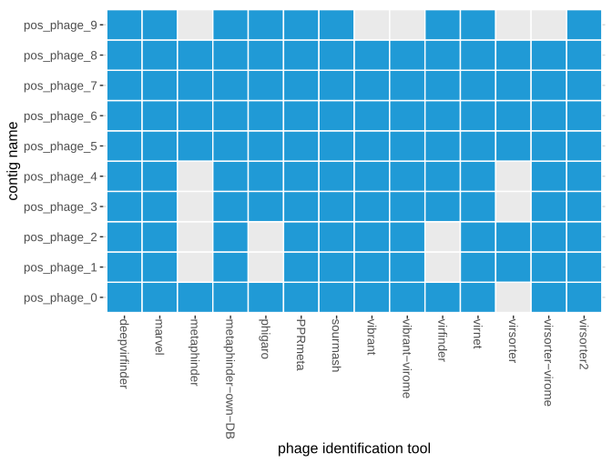

# Example run
We executed the following commands do perform a WtP test-run:
 
```bash
git clone https://github.com/replikation/What_the_Phage.git
nextflow run replikation/What_the_Phage \
--fasta What_the_Phage/test-data/all_pos_phage.fa \
--profile local,docker \
-work-dir work \
--cores 20
```
 
WtP will create a `results`-folder in your current working dir (where you executed WtP) and a subfolder with the name of your input-fasta - in our case `all_pos_phage`
 
## results
 
`literature`
* contains a Citations.bib file which you can import the in your citation program to have all the citations of the programs WtP uses for its analysis
 
`run info`
 
execution_report.html:
 
* this report gives an overview over: 
   * distribution of resource usage for each process (CPU, Memory, Job duration) 
   * information about each task in the workflow 
 
execution_timeline.html: 
 
* this report gives you an overview over the processes execution timeline 
 
`all_pos_phage` 
 
* your actual results
 
--------------------------------------------------
## all_pos_phage
 
`annotation_results` 
* output we need for the chromomap
 
`identified_contigs_by_tools` 
 
 * contains toolname.txt files  
 * show the sequence-name(fasta-header) identified by the corresponding tool
 
--------------------------------------------------
 
`phage_positive_contigs` 
 
 * contains a multi-fasta-file with all the positive fasta-sequences identified by the tools you can use for further analysis
 
--------------------------------------------------
 
`raw_data`
 
 * contains the raw output from the phage-identification-tools packed as toolname.tar.gz -file
 
--------------------------------------------------
 
`upsetr.svg` 
 

 
This chart (UpSetR plot) quantifies the result-intersections of the phage identification tools, similar to a Venn diagram. The amount of positive phage-sequences identified by each tool is represented on the left barplot in blue. The dot plot shows via line connection(s) which of the tools identified the exact same positive phage sequences. The amount of these shared matches is quantified as a barplot above each corresponding dot pattern.
 
--------------------------------------------------
 
`sample_overview-small.html, sample_overview-large.html`
 
   

 
The graphical output of the annotation shows an overview of the individual loci of the predicted ORFs and the corresponding genes in the fasta sequences identified as phages. For a better visibility, we have chosen 4 categories: tail, capsid, baseplate, and other. This output can be used to verify the identified sequences (if the predicted sequences make sense or not). The annotation results are additionally plotted in an interactive HTML-file and are available as a file for further analysis.
 
For an interactive chromamap you can check out the following link:
[chromomap results](https://replikation.github.io/What_the_Phage/index.html)
 
--------------------------------------------------
 
`phage_distribution.pdf`
 

 
Heatmap for phage sequences visualising the tool agreements per phage positive contig.
 
--------------------------------------------------
 
`taxonomic_classification` 
 
* sourmash classification (all_pos_phage_tax-class.tsv) so you know the name of the phages
 
 
contig  | prediction_value  | predicted_organism_name |
|-|-|-|
| pos_phage_0 | 1 | gi-1001940386-gb-KU522583.1-__Enterobacteria__phage__ECGD1,__complete__genome|
| pos_phage_1 | 1 | gi-1001941262-gb-KU647626.1-__Arthrobacter__phage__KellEzio,__complete__genome|
| pos_phage_2 | 1 | gi-1001941379-gb-KU647627.1-__Arthrobacter__phage__Kitkat,__complete__genome |
| pos_phage_3 | 1 | gi-1001941506-gb-KU647628.1-__Arthrobacter__phage__Mudcat,__complete__genome |
| pos_phage_4 | 1 | gi-1001941623-gb-KU647629.1-__Arthrobacter__phage__BarretLemon,__complete__genome|
|pos_phage_5| 1 |gi-1001941806-gb-KU598975.1-__Staphylococcus__phage__CNPx,__complete__genome |
|pos_phage_6| 1 |gi-1001941908-gb-KU595432.1-__Xanthomonas__phage__f20-Xaj,__complete__genome |
|pos_phage_7| 1 |gi-1001941964-gb-KU595433.1-__Xanthomonas__phage__f30-Xaj,__complete__genome |
|pos_phage_8| 1 |gi-1001942019-gb-KU595434.1-__Xanthomonas__phage__f29-Xaj,__complete__genome |
|pos_phage_9| 1 |gi-1001942081-gb-KT624200.1-__Bacillus__phage__SP-15,__complete__genome |
 
 
--------------------------------------------------
`all_pos_phage_quality_summary.tsv`
 
* check [CheckV](https://bitbucket.org/berkeleylab/checkv/src/master/) for a detailed explanation
 
contig_id|  contig_length|  genome_copies|  gene_count| viral_genes|  host_genes| checkv_quality| miuvig_quality| completeness| completeness_method|  contamination|  provirus|
|-|-|-|-|-|-|-|-|-|-|-|-|
pos_phage_0|  146647| 1|  243|  141|  1|  High-quality| High-quality| 97.03|  AAI-based|  0|  No|
pos_phage_1|  58871|  1|  97| 21| 0|  High-quality| High-quality| 100|  AAI-based|  0|  No|
pos_phage_2|  58560|  1|  95| 20| 0|  High-quality| High-quality| 99.47|  AAI-based|  0|  No|
pos_phage_3|  59443|  1|  90| 52| 0|  High-quality| High-quality| 100|  AAI-based|  0|  No|
pos_phage_4|  51290|  1|  74| 44| 0|  High-quality| High-quality| 100|  AAI-based|  0|  No|
pos_phage_5|  43293|  1|  69| 55| 0|  High-quality| High-quality| 100|  AAI-based|  0|  No|
pos_phage_6|  43851|  1|  53| 30| 0|  High-quality| High-quality| 98.71|  AAI-based|  0|  No|
pos_phage_7|  44262|  1|  54| 31| 0|  High-quality| High-quality| 99.64|  AAI-based|  0|  No|
pos_phage_8|  41865|  1|  60| 57| 0|  High-quality| High-quality| 97.29|  AAI-based|  0|  No|
pos_phage_9|  221908| 1|  310|  48| 9|  High-quality| High-quality| 100|  AAI-based|  0|  No|
 
 
 

